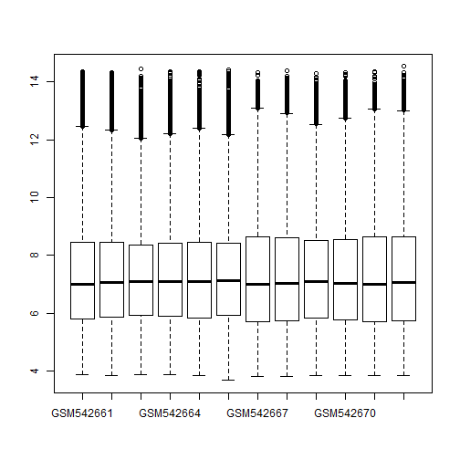
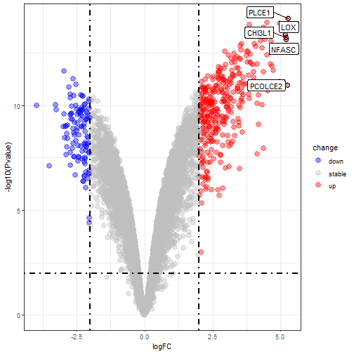
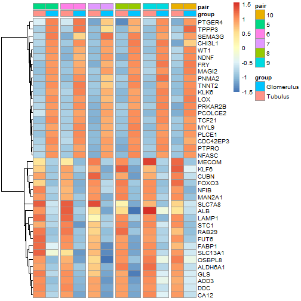
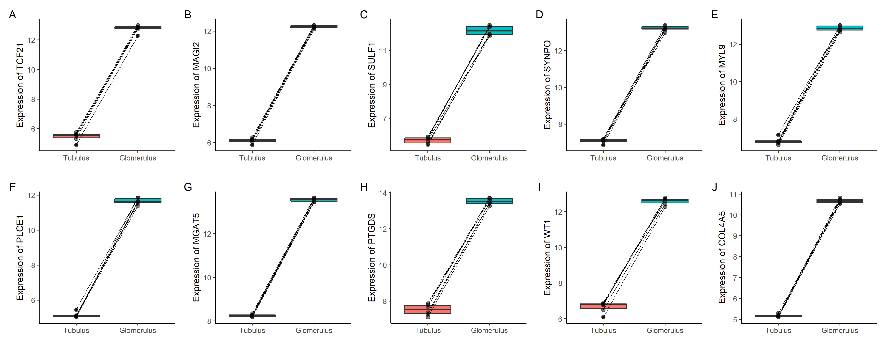

```r
# BiocManager::install(c( 'oligo' ),ask = F,update = F)
library(oligo) 

#BiocManager::install(c( 'pd.hg.u133a' ),ask = F,update = F)
library(pd.hg.u133a)

dir='F:/14个gse的分析结果/GSE21785_RAW/'
od=getwd()
setwd(dir)
celFiles <- list.celfiles(listGzipped = T)
celFiles
#>  [1] "GSM542661.CEL.gz" "GSM542662.CEL.gz" "GSM542663.CEL.gz" "GSM542664.CEL.gz"
#>  [5] "GSM542665.CEL.gz" "GSM542666.CEL.gz" "GSM542667.CEL.gz" "GSM542668.CEL.gz"
#>  [9] "GSM542669.CEL.gz" "GSM542670.CEL.gz" "GSM542671.CEL.gz" "GSM542672.CEL.gz"
affyRaw <- read.celfiles( celFiles )
#> Platform design info loaded.
#> Reading in : GSM542661.CEL.gz
#> Reading in : GSM542662.CEL.gz
#> Reading in : GSM542663.CEL.gz
#> Reading in : GSM542664.CEL.gz
#> Reading in : GSM542665.CEL.gz
#> Reading in : GSM542666.CEL.gz
#> Reading in : GSM542667.CEL.gz
#> Reading in : GSM542668.CEL.gz
#> Reading in : GSM542669.CEL.gz
#> Reading in : GSM542670.CEL.gz
#> Reading in : GSM542671.CEL.gz
#> Reading in : GSM542672.CEL.gz
setwd(od)
eSet <- rma(affyRaw)
#> Background correcting
#> Normalizing
#> Calculating Expression
eSet
#> ExpressionSet (storageMode: lockedEnvironment)
#> assayData: 22283 features, 12 samples 
#>   element names: exprs 
#> protocolData
#>   rowNames: GSM542661.CEL.gz GSM542662.CEL.gz ... GSM542672.CEL.gz (12
#>     total)
#>   varLabels: exprs dates
#>   varMetadata: labelDescription channel
#> phenoData
#>   rowNames: GSM542661.CEL.gz GSM542662.CEL.gz ... GSM542672.CEL.gz (12
#>     total)
#>   varLabels: index
#>   varMetadata: labelDescription channel
#> featureData: none
#> experimentData: use 'experimentData(object)'
#> Annotation: pd.hg.u133a
# http://math.usu.edu/jrstevens/stat5570/1.4.Preprocess_4up.pdf

exp = exprs(eSet)
pd = pData(eSet)
#处理表达矩阵列名和pd行名，去掉.CEL.gz
identical(rownames(pd),colnames(exp))
#> [1] TRUE
library(stringr)
rownames(pd) = str_remove(rownames(pd),".CEL.gz")
colnames(exp) = rownames(pd)
boxplot(exp)
pb2 = boxplot(exp)
```



```r
#pd有问题，从geo复制
tmp ="GSM542661	Tubulus_LD5
GSM542662	Tubulus_LD6
GSM542663	Tubulus_LD7
GSM542664	Tubulus_LD8
GSM542665	Tubulus_LD9
GSM542666	Tubulus_LD10
GSM542667	Glomerulus_LD5
GSM542668	Glomerulus_LD6
GSM542669	Glomerulus_LD7
GSM542670	Glomerulus_LD8
GSM542671	Glomerulus_LD9
GSM542672	Glomerulus_LD10
"
p1 = str_replace_all(tmp,"\t","\n")%>%
  str_replace_all("\n",",")%>%
  str_split(",",simplify = T)%>%
  as.character()%>%
  str_subset("GSM")
identical(rownames(pd),p1)
#> [1] TRUE
p2 = str_replace_all(tmp,"\t","\n")%>%
  str_replace_all("\n",",")%>%
  str_split(",",simplify = T)%>%
  as.character()%>%
  str_subset("LD")
p2
#>  [1] "Tubulus_LD5"     "Tubulus_LD6"     "Tubulus_LD7"     "Tubulus_LD8"    
#>  [5] "Tubulus_LD9"     "Tubulus_LD10"    "Glomerulus_LD5"  "Glomerulus_LD6" 
#>  [9] "Glomerulus_LD7"  "Glomerulus_LD8"  "Glomerulus_LD9"  "Glomerulus_LD10"
group_list = ifelse(str_detect(p2,"Tubulus"),"Tubulus","Glomerulus")
group_list=factor(group_list,levels = c("Tubulus","Glomerulus"))
pairinfo = factor(c(5:10,5:10))
#exp = log2(exp+1)
#PCA
{
  dat=as.data.frame(t(exp))
  library(FactoMineR)#画主成分分析图需要加载这两个包
  library(factoextra) 
  # pca的统一操作走起
  dat.pca <- PCA(dat, graph = FALSE)
  fviz_pca_ind(dat.pca,
               geom.ind = "point", # show points only (nbut not "text")
               col.ind = group_list, # color by groups
               #palette = c("#00AFBB", "#E7B800"),
               addEllipses = TRUE, # Concentration ellipses
               legend.title = "Groups"
  )
  dir.create("GSE21785_RAW")
  ggsave(paste0("GSE21785_RAW","/PCA.png"))
}
#> Warning in dir.create("GSE21785_RAW"): 'GSE21785_RAW' already exists
#> Saving 7 x 7 in image


#差异分析，用limma包----
library(limma)
design=model.matrix(~group_list+pairinfo)
fit=lmFit(exp,design)
fit=eBayes(fit)
deg=topTable(fit,coef=2,number = Inf)
head(deg)
#>                logFC   AveExpr        t      P.Value    adj.P.Val        B
#> 205111_s_at 5.284236  7.942250 60.27212 7.423523e-15 8.479257e-11 24.20437
#> 206067_s_at 4.498661  9.658178 57.93073 1.131291e-14 8.479257e-11 23.86255
#> 204931_at   4.974835  9.204506 57.52522 1.219012e-14 8.479257e-11 23.80124
#> 212098_at   3.861923 10.930764 56.33608 1.522103e-14 8.479257e-11 23.61768
#> 204072_s_at 4.373406  9.316730 54.85538 2.020196e-14 9.003207e-11 23.38099
#> 201431_s_at 3.823338  8.439581 52.05921 3.522398e-14 1.081534e-10 22.90779

#为deg数据框添加几列----
#1.加probe_id列，把行名变成一列
library(dplyr)
deg <- mutate(deg,probe_id=rownames(deg))
#tibble::rownames_to_column()
head(deg)
#>      logFC   AveExpr        t      P.Value    adj.P.Val        B    probe_id
#> 1 5.284236  7.942250 60.27212 7.423523e-15 8.479257e-11 24.20437 205111_s_at
#> 2 4.498661  9.658178 57.93073 1.131291e-14 8.479257e-11 23.86255 206067_s_at
#> 3 4.974835  9.204506 57.52522 1.219012e-14 8.479257e-11 23.80124   204931_at
#> 4 3.861923 10.930764 56.33608 1.522103e-14 8.479257e-11 23.61768   212098_at
#> 5 4.373406  9.316730 54.85538 2.020196e-14 9.003207e-11 23.38099 204072_s_at
#> 6 3.823338  8.439581 52.05921 3.522398e-14 1.081534e-10 22.90779 201431_s_at
#2.加symbol列，火山图要用
#id转换，查找芯片平台对应的包
#eSet[[1]]@annotation
#http://www.bio-info-trainee.com/1399.html
#hgu133a
if(!require(hgu133a.db))BiocManager::install("hgu133a.db")
library(hgu133a.db)
ls("package:hgu133a.db")
#>  [1] "hgu133a"              "hgu133a.db"           "hgu133a_dbconn"      
#>  [4] "hgu133a_dbfile"       "hgu133a_dbInfo"       "hgu133a_dbschema"    
#>  [7] "hgu133aACCNUM"        "hgu133aALIAS2PROBE"   "hgu133aCHR"          
#> [10] "hgu133aCHRLENGTHS"    "hgu133aCHRLOC"        "hgu133aCHRLOCEND"    
#> [13] "hgu133aENSEMBL"       "hgu133aENSEMBL2PROBE" "hgu133aENTREZID"     
#> [16] "hgu133aENZYME"        "hgu133aENZYME2PROBE"  "hgu133aGENENAME"     
#> [19] "hgu133aGO"            "hgu133aGO2ALLPROBES"  "hgu133aGO2PROBE"     
#> [22] "hgu133aMAP"           "hgu133aMAPCOUNTS"     "hgu133aOMIM"         
#> [25] "hgu133aORGANISM"      "hgu133aORGPKG"        "hgu133aPATH"         
#> [28] "hgu133aPATH2PROBE"    "hgu133aPFAM"          "hgu133aPMID"         
#> [31] "hgu133aPMID2PROBE"    "hgu133aPROSITE"       "hgu133aREFSEQ"       
#> [34] "hgu133aSYMBOL"        "hgu133aUNIGENE"       "hgu133aUNIPROT"
ids <- toTable(hgu133aSYMBOL)
head(ids)
#>    probe_id symbol
#> 1   1053_at   RFC2
#> 2    117_at  HSPA6
#> 3    121_at   PAX8
#> 4 1255_g_at GUCA1A
#> 5   1316_at   THRA
#> 6   1320_at PTPN21
#merge
deg <- inner_join(deg,ids,by="probe_id")
deg <- deg[!duplicated(deg$symbol),]
head(deg)
#>      logFC   AveExpr        t      P.Value    adj.P.Val        B    probe_id
#> 1 5.284236  7.942250 60.27212 7.423523e-15 8.479257e-11 24.20437 205111_s_at
#> 2 4.498661  9.658178 57.93073 1.131291e-14 8.479257e-11 23.86255 206067_s_at
#> 3 4.974835  9.204506 57.52522 1.219012e-14 8.479257e-11 23.80124   204931_at
#> 4 3.861923 10.930764 56.33608 1.522103e-14 8.479257e-11 23.61768   212098_at
#> 5 4.373406  9.316730 54.85538 2.020196e-14 9.003207e-11 23.38099 204072_s_at
#> 6 3.823338  8.439581 52.05921 3.522398e-14 1.081534e-10 22.90779 201431_s_at
#>   symbol
#> 1  PLCE1
#> 2    WT1
#> 3  TCF21
#> 4  MGAT5
#> 5    FRY
#> 6 DPYSL3
#3.加change列：上调或下调，火山图要用

logFC_t=2 #不同的阈值，筛选到的差异基因数量就不一样，后面的超几何分布检验结果就大相径庭。
change=ifelse(deg$P.Value>0.01,'stable', 
              ifelse( deg$logFC >logFC_t,'up', 
                      ifelse( deg$logFC < -logFC_t,'down','stable') )
)
deg <- mutate(deg,change)
head(deg)
#>      logFC   AveExpr        t      P.Value    adj.P.Val        B    probe_id
#> 1 5.284236  7.942250 60.27212 7.423523e-15 8.479257e-11 24.20437 205111_s_at
#> 2 4.498661  9.658178 57.93073 1.131291e-14 8.479257e-11 23.86255 206067_s_at
#> 3 4.974835  9.204506 57.52522 1.219012e-14 8.479257e-11 23.80124   204931_at
#> 4 3.861923 10.930764 56.33608 1.522103e-14 8.479257e-11 23.61768   212098_at
#> 5 4.373406  9.316730 54.85538 2.020196e-14 9.003207e-11 23.38099 204072_s_at
#> 6 3.823338  8.439581 52.05921 3.522398e-14 1.081534e-10 22.90779 201431_s_at
#>   symbol change
#> 1  PLCE1     up
#> 2    WT1     up
#> 3  TCF21     up
#> 4  MGAT5     up
#> 5    FRY     up
#> 6 DPYSL3     up
table(deg$change)
#> 
#>   down stable     up 
#>    111  11960    332
deg <- mutate(deg,v = -log10(P.Value))

#4.加ENTREZID列，后面富集分析要用
library(ggplot2)
library(clusterProfiler)
library(org.Hs.eg.db)
s2e <- bitr(unique(deg$symbol), fromType = "SYMBOL",
            toType = c( "ENTREZID"),
            OrgDb = org.Hs.eg.db)
#> 'select()' returned 1:many mapping between keys and columns
head(s2e)
#>   SYMBOL ENTREZID
#> 1  PLCE1    51196
#> 2    WT1     7490
#> 3  TCF21     6943
#> 4  MGAT5     4249
#> 5    FRY    10129
#> 6 DPYSL3     1809
head(deg)
#>      logFC   AveExpr        t      P.Value    adj.P.Val        B    probe_id
#> 1 5.284236  7.942250 60.27212 7.423523e-15 8.479257e-11 24.20437 205111_s_at
#> 2 4.498661  9.658178 57.93073 1.131291e-14 8.479257e-11 23.86255 206067_s_at
#> 3 4.974835  9.204506 57.52522 1.219012e-14 8.479257e-11 23.80124   204931_at
#> 4 3.861923 10.930764 56.33608 1.522103e-14 8.479257e-11 23.61768   212098_at
#> 5 4.373406  9.316730 54.85538 2.020196e-14 9.003207e-11 23.38099 204072_s_at
#> 6 3.823338  8.439581 52.05921 3.522398e-14 1.081534e-10 22.90779 201431_s_at
#>   symbol change        v
#> 1  PLCE1     up 14.12939
#> 2    WT1     up 13.94643
#> 3  TCF21     up 13.91399
#> 4  MGAT5     up 13.81756
#> 5    FRY     up 13.69461
#> 6 DPYSL3     up 13.45316
deg <- inner_join(deg,s2e,by=c("symbol"="SYMBOL"))

head(deg)
#>      logFC   AveExpr        t      P.Value    adj.P.Val        B    probe_id
#> 1 5.284236  7.942250 60.27212 7.423523e-15 8.479257e-11 24.20437 205111_s_at
#> 2 4.498661  9.658178 57.93073 1.131291e-14 8.479257e-11 23.86255 206067_s_at
#> 3 4.974835  9.204506 57.52522 1.219012e-14 8.479257e-11 23.80124   204931_at
#> 4 3.861923 10.930764 56.33608 1.522103e-14 8.479257e-11 23.61768   212098_at
#> 5 4.373406  9.316730 54.85538 2.020196e-14 9.003207e-11 23.38099 204072_s_at
#> 6 3.823338  8.439581 52.05921 3.522398e-14 1.081534e-10 22.90779 201431_s_at
#>   symbol change        v ENTREZID
#> 1  PLCE1     up 14.12939    51196
#> 2    WT1     up 13.94643     7490
#> 3  TCF21     up 13.91399     6943
#> 4  MGAT5     up 13.81756     4249
#> 5    FRY     up 13.69461    10129
#> 6 DPYSL3     up 13.45316     1809

library(dplyr)
dat <- mutate(deg,v=-log10(P.Value))
head(dat)
#>      logFC   AveExpr        t      P.Value    adj.P.Val        B    probe_id
#> 1 5.284236  7.942250 60.27212 7.423523e-15 8.479257e-11 24.20437 205111_s_at
#> 2 4.498661  9.658178 57.93073 1.131291e-14 8.479257e-11 23.86255 206067_s_at
#> 3 4.974835  9.204506 57.52522 1.219012e-14 8.479257e-11 23.80124   204931_at
#> 4 3.861923 10.930764 56.33608 1.522103e-14 8.479257e-11 23.61768   212098_at
#> 5 4.373406  9.316730 54.85538 2.020196e-14 9.003207e-11 23.38099 204072_s_at
#> 6 3.823338  8.439581 52.05921 3.522398e-14 1.081534e-10 22.90779 201431_s_at
#>   symbol change        v ENTREZID
#> 1  PLCE1     up 14.12939    51196
#> 2    WT1     up 13.94643     7490
#> 3  TCF21     up 13.91399     6943
#> 4  MGAT5     up 13.81756     4249
#> 5    FRY     up 13.69461    10129
#> 6 DPYSL3     up 13.45316     1809

#exp2,获得行名为基因名的表达矩阵----
exp2 = exp[match(deg$probe_id,rownames(exp)),]
dim(exp2)
#> [1] 12405    12
rownames(exp2) = deg$symbol
#火山图----
p <- ggplot(data = deg, 
            aes(x = logFC, 
                y = v)) +
  geom_point(alpha=0.4, size=3.5, 
             aes(color=change)) +
  ylab("-log10(Pvalue)")+
  scale_color_manual(values=c("blue", "grey","red"))+
  geom_vline(xintercept=c(-logFC_t,logFC_t),lty=4,col="black",lwd=0.8) +
  geom_hline(yintercept = -log10(0.01),lty=4,col="black",lwd=0.8) +
  theme_bw()
for_label <- deg %>% 
  filter(abs(logFC) >5& P.Value< 0.01)
p +
  geom_point(size = 3, shape = 1, data = for_label) +
  ggrepel::geom_label_repel(
    aes(label = symbol),
    data = for_label,
    color="black"
  )
```



```r
ggsave(paste0("GSE21785_RAW/","volcano.png"))
#> Saving 7 x 7 in image


#配对热图，用exp2画----
x=deg$logFC 
names(x)=deg$symbol
cg=c(names(head(sort(x),20)),
     names(tail(sort(x),20)))
library(pheatmap)
test = data.frame(gsm = colnames(exp),group_list,pairinfo)
test
#>          gsm group_list pairinfo
#> 1  GSM542661    Tubulus        5
#> 2  GSM542662    Tubulus        6
#> 3  GSM542663    Tubulus        7
#> 4  GSM542664    Tubulus        8
#> 5  GSM542665    Tubulus        9
#> 6  GSM542666    Tubulus       10
#> 7  GSM542667 Glomerulus        5
#> 8  GSM542668 Glomerulus        6
#> 9  GSM542669 Glomerulus        7
#> 10 GSM542670 Glomerulus        8
#> 11 GSM542671 Glomerulus        9
#> 12 GSM542672 Glomerulus       10
col = (arrange(test,pairinfo,group_list))$gsm
od = match(col,colnames(exp))
n=exp2[cg,od]

annotation_col=data.frame(group= as.character(group_list)[od],
                          pair = as.character(pairinfo)[od])
rownames(annotation_col)=colnames(n) 

#png(filename = "GSE21785_RAW/heatmapB.png")
pheatmap(n,show_colnames =F,
         #show_rownames = F,
         scale = "row",
         cluster_cols = F, 
         annotation_col=annotation_col,
         gaps_col = c(2,4,6,8,10)
) 
```



```r
#dev.off()

# 配对样本的箱线图----

dat <- data.frame(pairinfo=pairinfo,group=group_list,t(exp2))
#配对样本箱线图批量绘制,画10张玩玩

library(ggplot2)
x = colnames(dat)[3:12]
pl = list()
for(i in 1:length(x)){
  pl[[i]] = ggplot(dat, aes_string("group",colnames(dat)[i+2],fill="group")) +
    geom_boxplot() +
    geom_point(size=2, alpha=0.5) +
    geom_line(aes(group=pairinfo), colour="black", linetype="11") +
    xlab("") +
    ylab(paste("Expression of",colnames(dat)[i+2]))+
    theme_classic()+
    theme(legend.position = "none")
}
#拼图
library(patchwork)
pb_top10= wrap_plots(pl,nrow = 2)+plot_annotation(tag_levels = 'A')
pb_top10
```



```r
#ggsave(plot = pb_top10,filename = paste0("box.png"),width = 15,height = 6)
```

